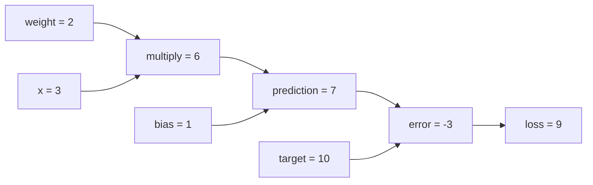

# Deep Learning 

A list of programs in python for machine learning and deep learning.

Run both linear classifiers on the full CIFAR-10 training set:

```bash
conda activate dl
python lc.py
```

This trains separate SVM and softmax models for 10 epochs on all 50,000 training
images, then prints accuracy and sample predictions on the separate 10,000-image
test set. Every training image is used once per epoch. Data is downloaded to the
ignored `data/` directory if needed.

To customize training and access all test predictions:

```python
from lc import train_full_cifar10

results = train_full_cifar10(num_epochs=10, batch_size=256)
svm_predictions = results["svm"]["predictions"]
softmax_predictions = results["softmax"]["predictions"]
```

Each result also contains `model`, `train_accuracy`, and `test_accuracy`.
The individual `train_svm_cifar10()` and `train_softmax_cifar10()` functions
still use the default 49,000/1,000 training/validation split.

## Optimization: gradient descent and SGD

```python
loss, dW, db = loss_fn(W, b, X_batch, y_batch, reg)
W -= learning_rate * dW
b -= learning_rate * db
```

The gradient describes how loss changes with each parameter. Subtracting it
moves downhill locally; the learning rate determines the step size. A step
that is too large can increase the loss. We update both weights and biases;
the existing loss functions regularize only the weights.

| Function / setting | Examples used for each update |
| --- | --- |
| `gradient_descent(...)` | Entire supplied training set |
| `stochastic_gradient_descent(..., batch_size=1)` | One randomly selected image (SGD) |
| `stochastic_gradient_descent(..., batch_size=128)` | 128 randomly selected images (mini-batch SGD) |

`num_iters` counts parameter updates. SGD samples a fresh batch each time;
it does not guarantee visiting every image, unlike `lc.py`'s epoch mode.
Both functions return `(W, b, loss_history)` and copy the starting parameters,
making it easy to compare runs from the same initialization. Each history
entry is the loss **before** an update: GD records full training loss, while
SGD records batch loss, which can be noisy even when training is working.

Run the comparison on a reproducible subset of 1,000 CIFAR-10 training images:

```bash
conda activate dl
python optimization.py
python optimization.py --loss softmax
python optimization.py --batch-size 1 --num-iters 1000
python optimization.py --learning-rate 0.001
```

Each run checks numerical versus analytical gradients on a tiny problem,
then trains GD and SGD from identical weights. It prints final losses on the
same training subset and accuracy on the 1,000-image validation split. The
number of updates is equal, but GD processes more images per update; this is
not an equal-compute benchmark. Use validation results to experiment with
learning rates and batch sizes. The default settings are learning examples,
not tuned CIFAR-10 hyperparameters.

You can also use the functions directly with the arrays from `load_cifar10()`:

```python
from lc import LinearClassifier, softmax_loss
from optimization import stochastic_gradient_descent
from utils import load_cifar10

X_train, y_train, X_val, y_val, _, _ = load_cifar10()
model = LinearClassifier(X_train.shape[1], 10, softmax_loss)
model.W, model.b, loss_history = stochastic_gradient_descent(
    softmax_loss, model.W, model.b, X_train, y_train,
    learning_rate=0.01, num_iters=1000, batch_size=128,
)
print("Validation accuracy:", model.accuracy(X_val, y_val))
```

`eval_numerical_gradient(f, x)` estimates derivatives by perturbing one
parameter at a time: `(f(x + h) - f(x - h)) / (2 * h)` along that coordinate.
Use it on tiny arrays to check your analytical gradients; it needs two loss
evaluations per parameter, so it is much too expensive for training. SVM
checks can disagree where a perturbation crosses a hinge-loss kink.

## Backpropagation: computing the gradients

[`backpropagation.py`](backpropagation.py) accompanies the
[CS231n backpropagation section](https://cs231n.github.io/optimization-2/).
Backpropagation computes gradients; gradient descent and SGD use them to update
parameters. This file breaks the existing softmax linear classifier into stages
and connects those stages to the optimizer in `optimization.py`.

Read the functions in this order:

| Functions | What to follow |
| --- | --- |
| `scalar_chain_rule()` | Forward intermediates, then chain rule through `(x+y)*z` |
| `branched_expression()` | Adding gradient contributions with `+=` when an input feeds multiple branches |
| `affine_forward()` / `affine_backward()` | Matrix derivatives and summing the broadcast bias gradient |
| `sigmoid_forward()` / `sigmoid_backward()` | Caching an activation and multiplying by its local derivative |
| `relu_forward()` / `relu_backward()` | A max gate that passes gradients through positive inputs |
| `softmax_cross_entropy()` | Combined softmax and mean cross-entropy, returning the score gradient |
| `linear_softmax_loss()` | Connecting forward and backward stages for CIFAR-10 |

For a scalar stage `out = f(x)`, the backward step is:

```text
dL/dx = (dL/dout) * (dout/dx)
         upstream     local
```

For example, `scalar_chain_rule(-2, 5, -4)` returns the value `-12` and
gradients `{"x": -4, "y": -4, "z": 3}`. These describe the sensitivity of
the output to each input. The forward pass saves `q = x + y`; the backward
pass uses it while traversing the multiply and addition operations in reverse.

The same process works on the CIFAR-10 classifier:

```python
scores, cache = affine_forward(X, W, b)
loss, dscores = softmax_cross_entropy(scores, y)
dX, dW, db = affine_backward(dscores, cache)

loss += reg * np.sum(W * W)
dW += 2 * reg * W
```

Here `X` is `(N, 3072)`, `W` is `(3072, 10)`, and `b` is `(10,)`.
`dX`, `dW`, and `db` have the same shapes as their corresponding inputs.
Bias is shared across examples, so its gradient sums over the batch. Weight
gradients receive contributions from both classification and regularization.
SGD updates `W` and `b` after backward finishes; the input images stay fixed.
The affine cache holds references, so keep its arrays unchanged until then.

Run the small exercises and numerical checks without loading a dataset:

```bash
conda activate dl
python backpropagation.py --skip-cifar
```

Run those checks followed by CIFAR-10 training:

```bash
python backpropagation.py
python backpropagation.py --num-train 5000 --num-iters 500
python backpropagation.py --batch-size 1
```

By default, the demo uses 1,000 training images and 200 mini-batch SGD updates,
then prints training loss and training/validation accuracy. It uses the same
linear softmax model as `lc.py`; the sigmoid and ReLU gates are separate
exercises for composing further stages. To access the model and batch losses:

```python
from backpropagation import run_cifar10_demo

result = run_cifar10_demo()
model = result["model"]
loss_history = result["loss_history"]
```

`run_gradient_checks()` checks the composed affine/sigmoid computation and the
regularized softmax loss against `eval_numerical_gradient()` on tiny float64
arrays. For vector outputs, it checks the scalar `sum(output * upstream)` to
verify the incoming gradient is applied correctly. ReLU uses derivative zero
at zero; numerical checks should avoid that kink.

### Automatic gradients with `Value`

`Value` in `backpropagation.py` records scalar operations so you can call
`.backward()` instead of writing the entire backward pass yourself:

```python
from backpropagation import Value

x = Value(-2, label="x")
y = Value(5, label="y")
z = Value(-4, label="z")
output = (x + y) * z
output.backward()

print(output.data)          # -12.0
print(x.grad, y.grad, z.grad)  # -4.0 -4.0 3.0
```

Each node stores its `data`, its `grad`, and edges to its input nodes with
their local derivatives. The overloaded operators build those edges during
the forward pass. `backward()` orders the graph, starts the output gradient
at 1, and adds `upstream_gradient * local_derivative` to each input's gradient.
Repeated uses such as `x*x` contribute twice, even though they share one node.

Supported operations are `+`, `-`, `*`, `/`, constant powers (`x ** 2`),
`.exp()`, `.log()`, `.sigmoid()`, and `.relu()`. You can mix `Value` objects
with ordinary numbers. `Value` computes scalar first derivatives; the NumPy
functions handle arrays and the CIFAR-10 demo.

Every `.backward()` call clears gradients for nodes reachable from that
output, so calling it again recomputes them. Contributions from branches
are accumulated within each call. An optional `seed` scales the output's
starting gradient, for example `output.backward(seed=0.5)`.

Gradient descent still updates parameters separately. Rebuild the expression
after each update, since every graph stores values and local derivatives
from its own forward pass:

```python
weight = Value(0)
for _ in range(20):
    loss = (weight - 3) ** 2
    loss.backward()
    weight.data -= 0.1 * weight.grad
print(weight.data)  # approximately 2.9654
```

`python backpropagation.py --skip-cifar` now prints the manual and automatic
gradients for the same expression so you can compare them.

### Worked example: one prediction and one update

Run [`value_example.py`](value_example.py) for an annotated example that prints
each intermediate value and its gradient:

```bash
conda activate dl
python value_example.py
```

The model predicts a number using `prediction = weight * x + bias`. Start with
`weight=2`, `x=3`, and `bias=1`, and try to predict the target `10`:

```python
from backpropagation import Value

weight = Value(2.0, label="weight")
x = Value(3.0, label="x")
bias = Value(1.0, label="bias")

prediction = weight * x + bias     # Value with data=7
loss = (prediction - 10.0) ** 2    # Value with data=9
loss.backward()

print(weight.grad)  # -18.0
print(bias.grad)    # -6.0
print(x.grad)       # -12.0
```

The operators build this graph during the forward pass:



Calling `loss.backward()` walks backward from the loss. It starts with
`loss.grad = 1` because the derivative of the loss with respect to itself is
one. For this example, the chain rule gives:

| Gradient | Calculation | Result |
| --- | --- | --- |
| `dL/dprediction` | `2 * (prediction - target)` | `-6` |
| `dL/dweight` | `dL/dprediction * x` | `-18` |
| `dL/dbias` | `dL/dprediction * 1` | `-6` |
| `dL/dx` | `dL/dprediction * weight` | `-12` |

`weight.grad = -18` means a small increase of `epsilon` in the weight changes
the loss by approximately `-18 * epsilon`, holding the other inputs fixed.
The gradient describes local sensitivity; `.backward()` fills `.grad` without
changing the parameters. Although `x` also gets a gradient, this training
example keeps the input fixed and updates the weight and bias:

```python
learning_rate = 0.01
weight.data -= learning_rate * weight.grad  # 2.18
bias.data -= learning_rate * bias.grad      # 1.06

new_prediction = weight * x + bias
new_loss = (new_prediction - 10.0) ** 2
print(new_prediction.data)  # approximately 7.60
print(new_loss.data)        # approximately 5.76, down from 9
```

The new forward pass uses the updated parameters. The original `loss.data`
remains `9`: a `Value` records a computation at the time its graph was built.
Repeat the forward pass, `.backward()`, and parameter updates to keep training.
